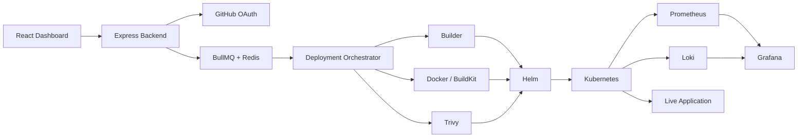

<div align="center">


<br>

### Backend engineer who also owns the infrastructure it runs on.

<br>


<br>

[](https://git.io/typing-svg)

<br>

**BCA (Cyber Security) @ UPES Dehradun** · **Backend Development · DevOps · Platform Engineering** · **Open to Internships & Opportunities**

<br>

[](https://www.linkedin.com/in/shaurya-s-701b7a305/)
[](https://github.com/shaurya-sehgal5)
[](mailto:shauryasehgal555@gmail.com)

</div>

---

```bash
┌──(shaurya㉿devops)-[~]
└─$ cat /etc/identity
```

```yaml
name        : Shaurya Sehgal
education   : BCA (Cyber Security) — UPES Dehradun, expected July 2027
role        : Backend Development · DevOps · Platform Engineering
focus       : APIs · Distributed Systems · Kubernetes · CI/CD · DevSecOps
currently   : Building VeloCore
mindset     : "understand the system, automate the system"
open_to     : Backend · DevOps · Platform · Cloud · SRE
```

---

# ⚡ I Build Backend Systems — And the Infrastructure That Runs Them

Most of my work revolves around two questions:

> **How do you design a backend that holds up under real, asynchronous, failure-prone conditions?**
> **And what happens between a developer writing code and that code becoming a reliable production service?**

Both are the same problem from different sides — APIs, data models, and job queues on one end; containers, orchestration, and CI/CD on the other.

Instead of building another CRUD application, I built **VeloCore** — a self-hosted Platform-as-a-Service that turns a GitHub repository into a running application on Kubernetes, backed by a PostgreSQL-modeled, queue-driven backend.

---

# 🚀 VeloCore

<div align="center">

### **Self-hosted PaaS / Deployment Orchestration Platform**

**Git Push → Build → Security Scan → Kubernetes → Live Application → Monitoring**

<br>

[](https://github.com/shaurya-sehgal5/VeloCore)

</div>

VeloCore is my flagship Platform Engineering project, built solo in ~35 days.

It provides a deployment experience similar to platforms such as Vercel, Railway, Render and Coolify — but the infrastructure is **owned and controlled by the user**.

The developer connects GitHub, selects a repository and deploys. VeloCore handles the infrastructure underneath.

VeloCore currently brings together **170+ backend modules, a 17-stage deployment pipeline, 5+ supported framework categories, and 20+ tracked platform/runtime metrics — taking a push live end-to-end in ~60–100 seconds.**

---

## 🧠 What VeloCore Actually Does

### 🔄 Deployment Orchestration

```text
GitHub
  ↓
Clone
  ↓
Framework Detection
  ↓
Dependency Graph
  ↓
Deployment Planning
  ↓
Docker Build
  ↓
Security Scan
  ↓
Helm Generation
  ↓
Kubernetes Deployment
  ↓
Health Verification
  ↓
Runtime Registration
  ↓
Monitoring
  ↓
Live Application
```

The backend — Node.js/Express, PostgreSQL, and BullMQ/Redis — coordinates the complete deployment lifecycle rather than simply running a shell script.

Deployment stages are explicitly tracked as state transitions, so failures can be reasoned about and recovered from — automatic rollback validates rollout health against Kubernetes liveness/readiness probes and restores the last known-good Helm release on failure.

---

# 🏗️ Architecture



### Core Components

| Component                   | Responsibility                                |
| --------------------------- | --------------------------------------------- |
| **Deployment Orchestrator** | Coordinates the complete deployment lifecycle |
| **Builder**                 | Detects frameworks and generates build plans  |
| **BullMQ**                  | Queues and controls deployment jobs           |
| **Redis**                   | Queue backend                                 |
| **Docker / BuildKit**       | Builds application images                     |
| **Trivy**                   | Container + CVE-severity security scanning    |
| **Helm**                    | Dynamic Kubernetes workload generation        |
| **Kubernetes**              | Application runtime                           |
| **Runtime Manager**         | Tracks live deployments and runtime state     |
| **PostgreSQL**              | Deployment metadata, events, rollback history |
| **Prometheus**              | Metrics collection                            |
| **Grafana**                 | Visualization and dashboards                  |
| **Loki**                    | Persistent log aggregation                    |
| **Socket.IO**               | Real-time deployment logs                     |

The architecture and component responsibilities are based directly on the VeloCore implementation.

---

# 🛠️ Technology Stack

<div align="center">

### Platform & Infrastructure


### Backend & Systems


### DevSecOps & Observability


### Application


</div>

The core VeloCore stack is Node.js/Express, React, Docker, Kubernetes, Helm, BullMQ/Redis, PostgreSQL, Prometheus/Grafana/Loki and Trivy.

---

# 💼 Beyond VeloCore

VeloCore is my main project, but it wasn't built in isolation.

**Cloud & Kubernetes Labs** — Hands-on AWS and infrastructure labs covering cloud networking, compute, storage, IAM, load balancing, CI/CD, Kubernetes (Minikube, Kind), and Terraform IaC. Used to build the infrastructure knowledge applied directly in VeloCore.

**Freelance — Nitro Media** — Independently deliver client web projects end-to-end (requirements → build → deployment), including sites for Harjas Hostel (React/Tailwind/Framer Motion), Om Residency (mobile-first, glassmorphism), and R.C. Eye & Dental Hospital.

**VeloCore is where the infrastructure concepts come together into one system.**

---

# 📚 What I'm Deepening

```bash
┌──(shaurya㉿devops)-[~]
└─$ ./current-focus.sh
```

```text
[01] Kubernetes
     ├── workloads
     ├── networking
     ├── scheduling
     ├── probes
     ├── scaling
     └── Helm

[02] Cloud
     ├── AWS
     ├── networking
     ├── compute
     ├── IAM
     └── managed Kubernetes

[03] Infrastructure
     ├── Terraform
     ├── Linux
     ├── Docker
     └── automation

[04] Delivery
     ├── CI/CD
     ├── GitHub Actions
     └── deployment orchestration

[05] Reliability
     ├── Prometheus
     ├── Grafana
     ├── Loki
     └── failure recovery

[06] Security
     ├── container scanning
     ├── secrets
     ├── CVEs
     └── DevSecOps
```

---

# 🎯 What I'm Looking For

I'm currently looking for opportunities where I can work close to backend systems, infrastructure, or both.

```text
Backend Development / SDE
DevOps Engineering
Platform Engineering
Cloud Infrastructure
DevSecOps
Site Reliability Engineering
Backend / DevOps / Cloud Internships
```

I'm particularly interested in teams where I can work with:

```text
Node.js / APIs
   +
PostgreSQL / Redis
   +
Docker / Kubernetes
   +
AWS / Terraform
   +
CI/CD
   +
Observability
   +
Security
```

---

# 📊 GitHub Activity

<div align="center">


<br><br>


<br><br>


</div>

---

<div align="center">

### `build → automate → observe → secure → improve`

<br>

[](https://www.linkedin.com/in/shaurya-s-701b7a305/)
[](https://github.com/shaurya-sehgal5)

<br><br>

<sub><code>infrastructure is the product · automation is the interface · reliability is the goal</code></sub>

<br><br>


</div>
