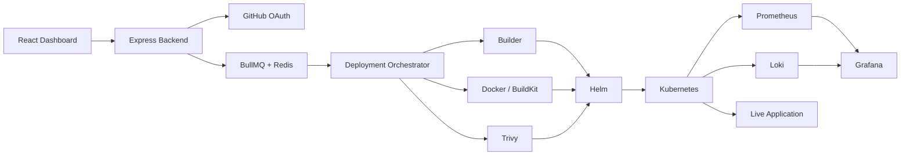

<div align="center">


<br>

[](https://git.io/typing-svg)

<br>

**BCA @ UPES Dehradun** · **DevOps / Platform Engineering** · **Open to Internships & Opportunities**


<br>

[](https://www.linkedin.com/in/shaurya-s-701b7a305/)
[](https://github.com/shaurya-sehgal5)
[](mailto:shauryasehgal555@gmail.com)

</div>

---

```bash
┌──(shaurya㉿devops)-[~]
└─$ cat /etc/identity
```

```yaml
name        : Shaurya Sehgal
education   : BCA — UPES Dehradun
role        : DevOps / Platform Engineering
focus       : Cloud Infrastructure · Kubernetes · CI/CD · DevSecOps
currently   : Building VeloCore
mindset     : "understand the system, automate the system"
open_to     : DevOps · Platform · Cloud · DevSecOps · SRE
```

---

# ⚡ I Build Platforms, Not Just Projects

Most of my work revolves around one question:

> **What happens between a developer writing code and that code becoming a reliable production service?**

That's the layer I'm interested in.

Infrastructure.
Containers.
CI/CD.
Kubernetes.
Security.
Observability.
Automation.
Failure recovery.

Instead of building another CRUD application, I built **VeloCore** — a self-hosted Platform-as-a-Service that turns a GitHub repository into a running application on Kubernetes.

---

# 🚀 VeloCore

<div align="center">

### **Self-hosted PaaS / Deployment Orchestration Platform**

**Git Push → Build → Security Scan → Kubernetes → Live Application → Monitoring**

<br>

[](https://github.com/shaurya-sehgal5/VeloCore)

</div>

VeloCore is my flagship Platform Engineering project.

It provides a deployment experience similar to platforms such as Vercel, Railway, Render and Coolify — but the infrastructure is **owned and controlled by the user**.

The developer connects GitHub, selects a repository and deploys.

VeloCore handles the infrastructure underneath:

VeloCore currently brings together **170+ backend modules, 17 deployment stages, 4 supported framework categories and 3 observability systems**.

---

## 🧠 What VeloCore Actually Does

### 🔄 Deployment Orchestration

```text
GitHub
  ↓
Clone
  ↓
Framework Detection
  ↓
Dependency Graph
  ↓
Deployment Planning
  ↓
Docker Build
  ↓
Security Scan
  ↓
Helm Generation
  ↓
Kubernetes Deployment
  ↓
Health Verification
  ↓
Runtime Registration
  ↓
Monitoring
  ↓
Live Application
```

The backend coordinates the complete deployment lifecycle rather than simply running a shell script.

Deployment stages are explicitly tracked so failures can be reasoned about and recovered from.

---
# 🏗️ Architecture



### Core Components

| Component                   | Responsibility                                |
| --------------------------- | --------------------------------------------- |
| **Deployment Orchestrator** | Coordinates the complete deployment lifecycle |
| **Builder**                 | Detects frameworks and generates build plans  |
| **BullMQ**                  | Queues and controls deployment jobs           |
| **Redis**                   | Queue backend                                 |
| **Docker / BuildKit**       | Builds application images                     |
| **Trivy**                   | Container security scanning                   |
| **Helm**                    | Dynamic Kubernetes workload generation        |
| **Kubernetes**              | Application runtime                           |
| **Runtime Manager**         | Tracks live deployments and runtime state     |
| **Prometheus**              | Metrics collection                            |
| **Grafana**                 | Visualization and dashboards                  |
| **Loki**                    | Persistent log aggregation                    |
| **Socket.IO**               | Real-time deployment logs                     |

The architecture and component responsibilities are based directly on the VeloCore implementation.

---
# 🛠️ Technology Stack

<div align="center">

### Platform & Infrastructure


### Backend & Systems


### DevSecOps & Observability


### Application


</div>

The core VeloCore stack is Node.js/Express, React, Docker, Kubernetes, Helm, BullMQ/Redis, PostgreSQL, Prometheus/Grafana/Loki and Trivy.

---

# 🧪 Beyond VeloCore

VeloCore is my main project, but it wasn't built in isolation.

I've also built **hands-on AWS and infrastructure labs** covering cloud networking, compute, storage, IAM, load balancing, CI/CD, Kubernetes and Infrastructure as Code.

Those labs were primarily used to build the underlying infrastructure knowledge that I applied while building VeloCore.

**VeloCore is where those concepts come together into one system.**

---

# 📚 What I'm Deepening

```bash
┌──(shaurya㉿devops)-[~]
└─$ ./current-focus.sh
```

```text
[01] Kubernetes
     ├── workloads
     ├── networking
     ├── scheduling
     ├── probes
     ├── scaling
     └── Helm

[02] Cloud
     ├── AWS
     ├── networking
     ├── compute
     ├── IAM
     └── managed Kubernetes

[03] Infrastructure
     ├── Terraform
     ├── Linux
     ├── Docker
     └── automation

[04] Delivery
     ├── CI/CD
     ├── GitHub Actions
     └── deployment orchestration

[05] Reliability
     ├── Prometheus
     ├── Grafana
     ├── Loki
     └── failure recovery

[06] Security
     ├── container scanning
     ├── secrets
     ├── CVEs
     └── DevSecOps
```

---

# 🎯 What I'm Looking For

I'm currently looking for opportunities where I can work close to infrastructure and production systems.

```text
DevOps Engineering
Platform Engineering
Cloud Infrastructure
DevSecOps
Site Reliability Engineering
Infrastructure Engineering
DevOps / Cloud Internships
```

I'm particularly interested in teams where I can work with:

```text
Linux
   +
AWS
   +
Docker
   +
Kubernetes
   +
Terraform
   +
CI/CD
   +
Observability
   +
Security
```

---

# 📊 GitHub Activity

<div align="center">


<br><br>


<br><br>


</div>

---


<div align="center">

### `build → automate → observe → secure → improve`

<br>

[](https://www.linkedin.com/in/shaurya-s-701b7a305/)
[](https://github.com/shaurya-sehgal5)

<br><br>

<sub><code>infrastructure is the product · automation is the interface · reliability is the goal</code></sub>

<br><br>


</div>
